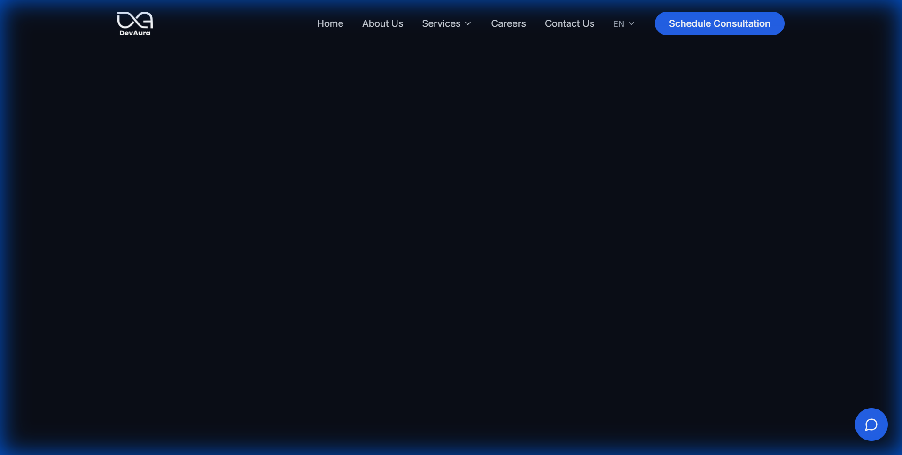
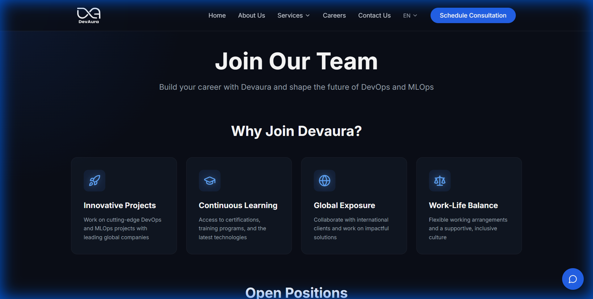
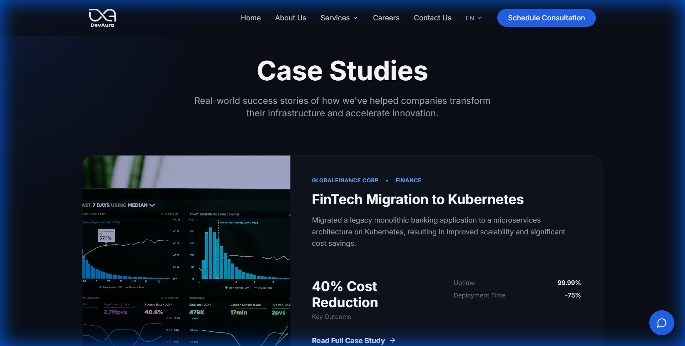
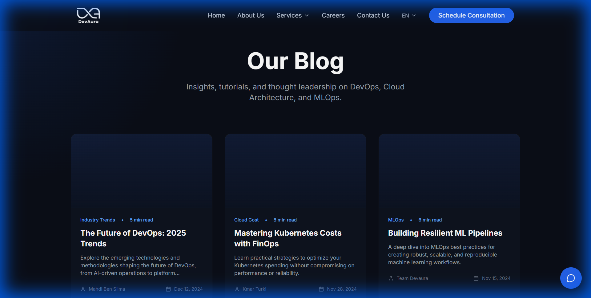

# Devaura - DevOps Agency Website

<div align="center">
  
  <br/>
  <br/>
  
  [](https://github.com/DevAura-Services/landing-page/actions/workflows/deploy.yml)
</div>

Devaura is a modern, high-performance website for a premier DevOps and MLOps agency. Built with Next.js 14, Tailwind CSS, and Framer Motion, it features a responsive design, smooth animations, and a dark-themed aesthetic tailored for the tech industry.

---

## 📸 Screenshots

### Home Page

*The landing page features an immersive hero section, infinite tech marquee, and service highlights.*

### Careers Page

*A dedicated careers section listing open positions with animated icons and detailed descriptions.*

### Case Studies

*Showcasing success stories with performance metrics and client results.*

### Blog

*A hub for industry insights, tutorials, and thought leadership.*

---

## ✨ Features

-   **Dynamic Landing Page**:
    -   Immersive Hero section with gradient effects.
    -   **Tech Marquee**: Infinite scrolling animation displaying core technologies (Docker, K8s, AWS, etc.) in alternating directions.
    -   **Services Hub**: Grid layout highlighting key advantages (Talent, Cost, Location).
-   **Comprehensive Content**:
    -   **Careers**: Detailed job listings with dynamic routing.
    -   **Case Studies**: Real-world success stories with visual metrics.
    -   **Blog**: Industry articles and insights.
    -   **Legal**: Terms of Service, Privacy Policy, and Cookie Consent with localStorage persistence.
-   **Interactive Components**:
    -   Responsive Navbar with mobile drawer.
    -   Contact Form with validation.
    -   **Chatbot**: Interactive chatbot for user engagement.
-   **Tech Stack**:
    -   [Next.js 14](https://nextjs.org/) (App Router)
    -   [Tailwind CSS](https://tailwindcss.com/)
    -   [Lucide React](https://lucide.dev/) (Icons)
    -   [Framer Motion](https://www.framer.com/motion/) (Animations)
-   **DevOps Ready**:
    -   Dockerized (`Dockerfile`, `.dockerignore`).
    -   CI/CD pipelines for automated deployment.

## 🛠️ Getting Started

### Prerequisites

-   Node.js 18+
-   npm or yarn

### Installation

1.  Clone the repository:
    ```bash
    git clone https://github.com/DevAura-Services/landing-page.git
    cd landing-page
    ```

2.  Install dependencies:
    ```bash
    npm install
    ```

3.  Run the development server:
    ```bash
    npm run dev
    ```

4.  Open [http://localhost:3000](http://localhost:3000) with your browser.

## 🐳 Docker Support

Build the container:
```bash
docker build -t devaura-website .
```

Run the container:
```bash
docker run -p 3000:3000 devaura-website
```

## 🚀 Deployment

This project is configured to automatically deploy to **GitHub Pages** using GitHub Actions.

### How it works
1.  **Workflow**: The pipeline is defined in `.github/workflows/deploy.yml`.
2.  **Trigger**: Pushing to the `main` branch triggers the workflow.
3.  **Process**:
    -   Installs dependencies and builds the project.
    -   Generates a static export (`output: "export"` in `next.config.js`).
    -   Uploads the build artifact.
    -   Deploys to the `gh-pages` environment.

### Configuration
-   **Static Export**: `output: "export"` is enabled in `next.config.js`.
-   **Base Path**: `basePath` is configured to match the repository name (e.g., `/landing-page`) for correct routing on GitHub Pages.
-   **Images**: Image optimization is disabled (`unoptimized: true`) as GitHub Pages doesn't support the default Next.js image server.

## 📁 Project Structure

```
devaura-website/
├── app/                # Next.js App Router pages and layouts
│   ├── blog/           # Blog listing page
│   ├── careers/        # Careers pages (listing & details)
│   ├── case-studies/   # Case studies listing page
│   ├── legal/          # Legal pages (Terms, Privacy)
│   ├── globals.css     # Global styles and Tailwind directives
│   ├── layout.js       # Root layout (Navbar, Footer)
│   └── page.js         # Landing page
├── components/         # Reusable React components
│   ├── Hero.js
│   ├── Navbar.js
│   ├── Footer.js
│   ├── TechMarquee.js
│   ├── Chatbot.js
│   └── CookieConsent.js
├── public/             # Static assets (images, screenshots)
└── ...config files
```

## 📄 License

This project is licensed under the MIT License.